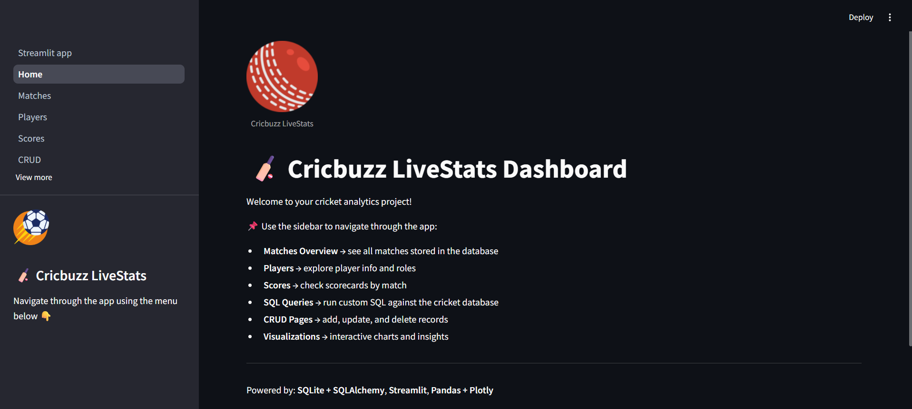
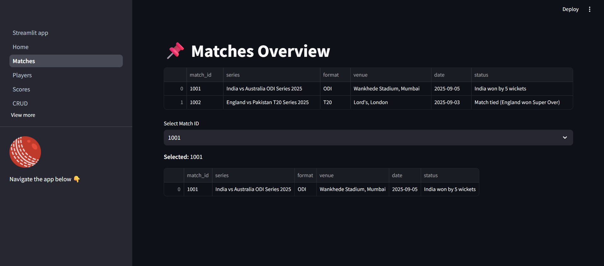
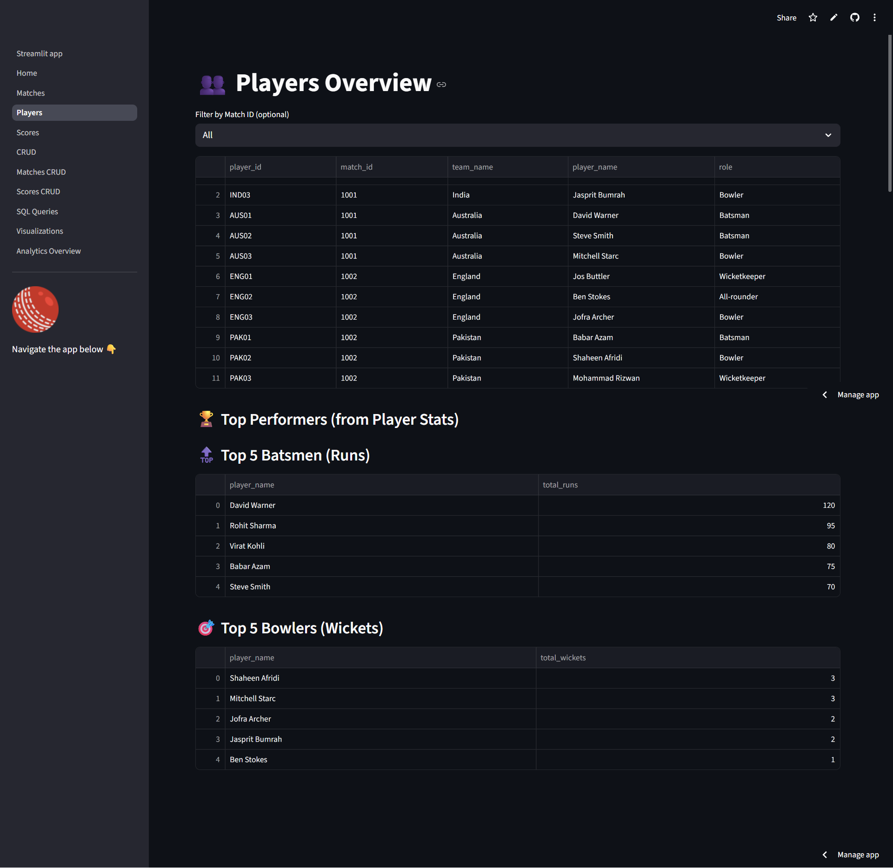
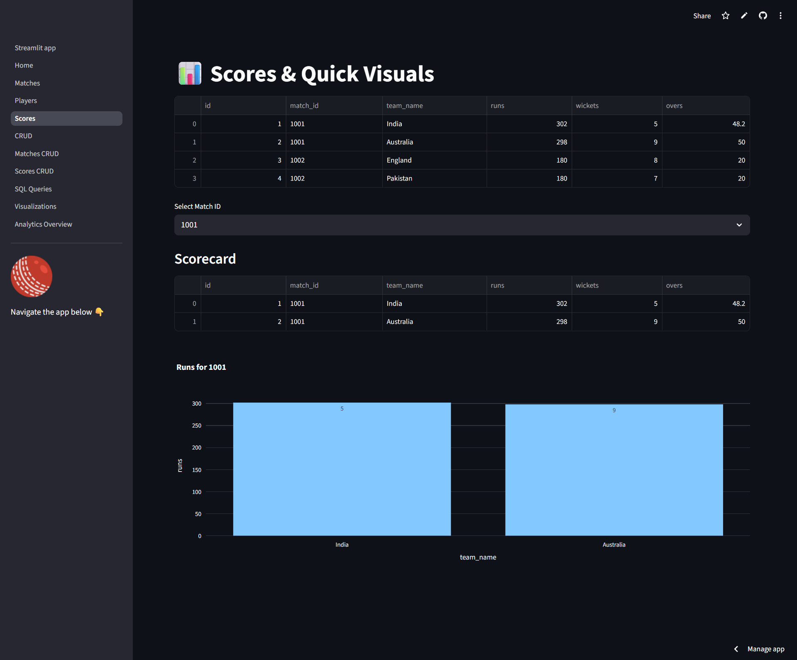
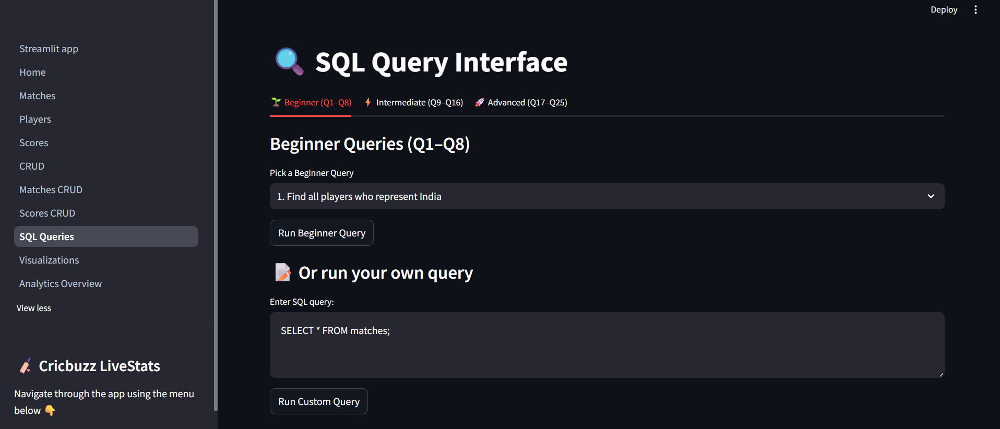
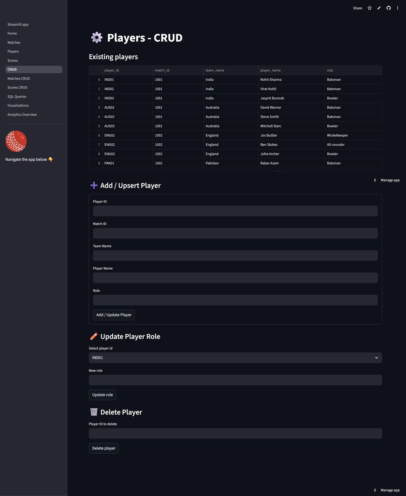
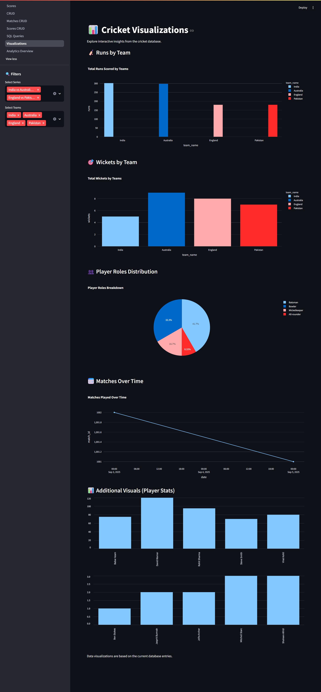

# 🏏 Cricbuzz LiveStats: Real-Time Cricket Insights & SQL Analytics

An interactive multi-page cricket analytics dashboard built with **Python, SQLite, and Streamlit**.
It integrates cricket match data (sample JSON or live API), stores it in a database, and provides live dashboards, visualizations, and SQL query practice.

---

## Features
- 🌐 API integration (Cricbuzz/unofficial JSON or sample dataset)
- 🗄️ SQLite database backend
- 📊 Streamlit multi-page dashboard:
  
  - Home
    
    

  - Matches Overview
  
    

  - Players
    
    

  - Scorecards
    
    

  - SQL Queries (25 beginner–advanced questions)
  
    

  - CRUD operations
  
    
  
  - Visualizations (team, players, runs, wickets)
  
    

- 🔍 Custom SQL query interface
- 📤 Export data to CSV
- 📦 Deployable on Streamlit Cloud / Render


## Tech Stack
- **Python 3.12** (pandas, sqlite3, SQLAlchemy, requests)
- **Streamlit** (for the web app)
- **SQLite** (lightweight database)
- **Tabulate** (pretty console output)
- **SQLAlchemy** (connection handling)
- **Pandas** (data wrangling)
- **Requests** (API integration)

---

## Project Structure

cricbuzz-livestats/
│
├── streamlit_app.py # Entry point for Streamlit
├── logo.png # App logo
├── requirements.txt
├── README.md
├── sample_cricket_data.json # Mock data
│
├── utils/
│ ├── create_db.py # Create & populate DB from JSON
│ └── db_connection.py # Centralized DB functions
│
├── pages/
│ ├── 1_Home.py
│ ├── 2_Matches.py
│ ├── 3_Players.py
│ ├── 4_Scores.py
│ ├── 5_SQL_Queries.py
│ ├── 6_CRUD.py
│ ├── 7_Matches_CRUD.py
│ ├── 8_Scores_CRUD.py
│ └── 9_Visualizations.py

---

## Run the App

```bash

\# Install dependencies

pip install -r requirements.txt


\# Run Streamlit app

streamlit run streamlit\_app.py

```

## Description

•	Home Page → Navigation + Project overview
•	Matches & Players Pages → Explore raw data
•	Scorecards & Visuals → Runs, wickets, comparisons
•	SQL Queries Page → 25 beginner → advanced queries + custom query box
•	CRUD Pages → Add, update, delete records
•	Analytics Overview → Leaderboards, KPIs, trends

## Use Cases

•	Sports Media & Broadcasting
•	Fantasy Cricket Platforms
•	Cricket Analytics Firms
•	Educational SQL Projects

## Credits

•	Mock data created for portfolio purposes
•	Inspired by Cricbuzz APIs and community-built cricket datasets

---

## 👩‍💻 Author
Ritu Thakur
Data Analyst | SQL • Power BI • Python • Streamlit

📍 Hyderabad, India
📧 ritut452@gmail.com
